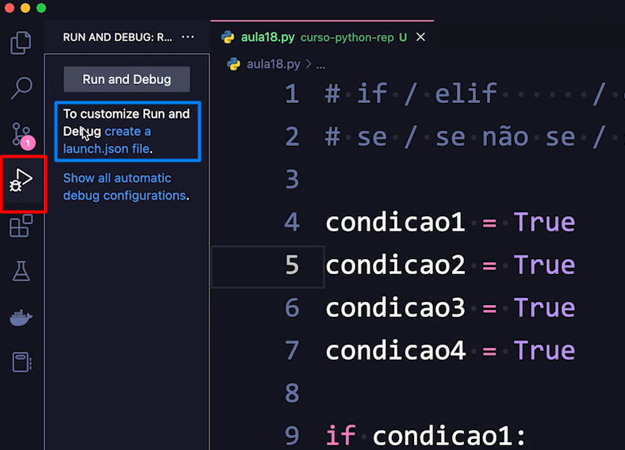
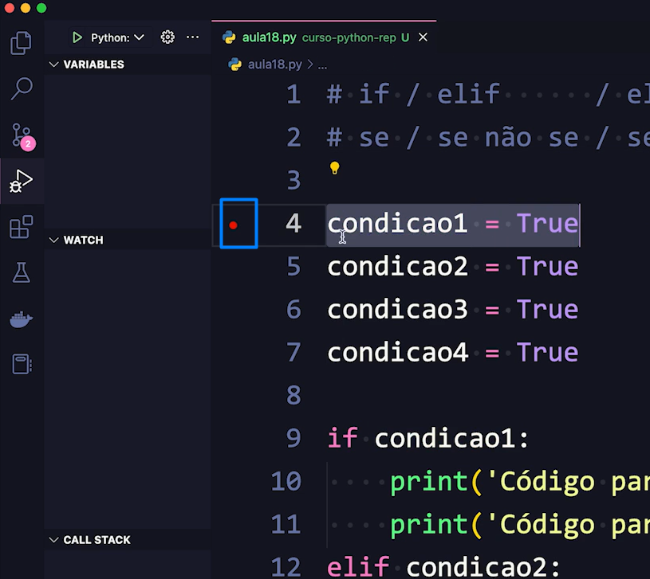
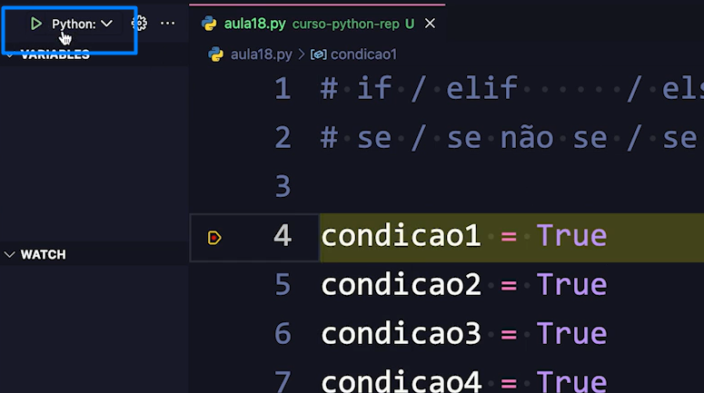
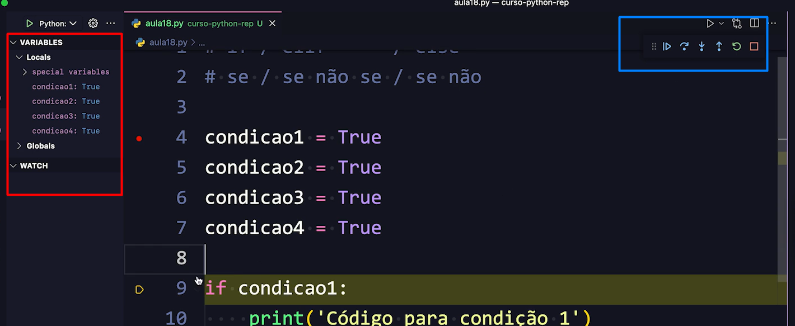

# Debugger do VS Code e Interpretador do Python
Nessa aula o professor mostra como funciona o Debugger do VS Code e o interpretador do python.

Em vermelho é a opção que clicamos para abrir a tela de execução do debugger e em azul é para criar o arquivo do launch do interpretador (NÃO precisa mudar nada das configurações do interpretador).

Feito isso, marcamos a partir de onde onde o breakpoint irá analisar e debugar o código.

Depois de selecionado o breakpoint, executamos o debug. Na opção no canto superior esquerdo da tela (em azul).

Agora, basta analisarmos o debug e o interpretador. Em vermelho temos um resumo do interpretador e em AZUL um controle dos steps que queremos executar.

## END